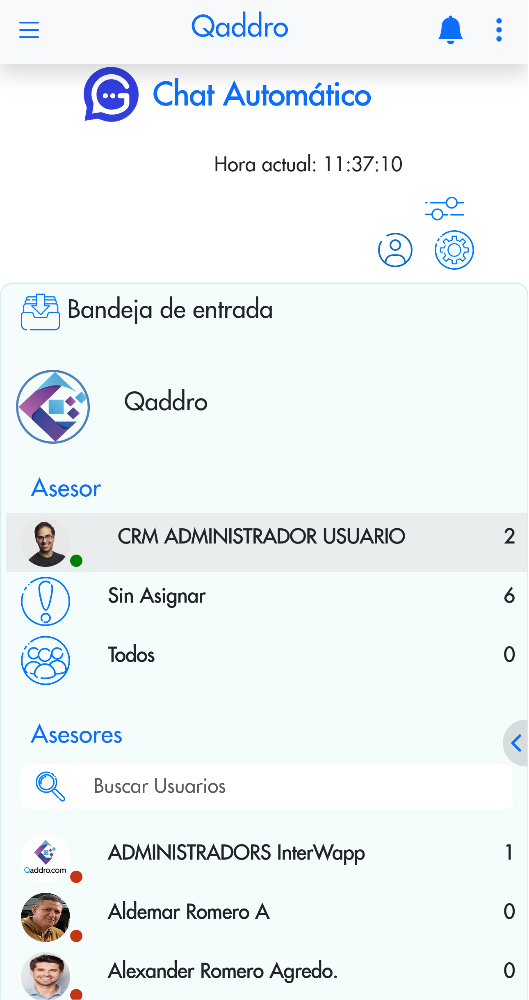
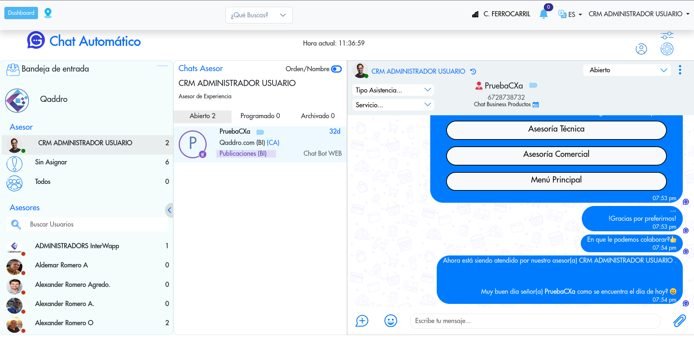
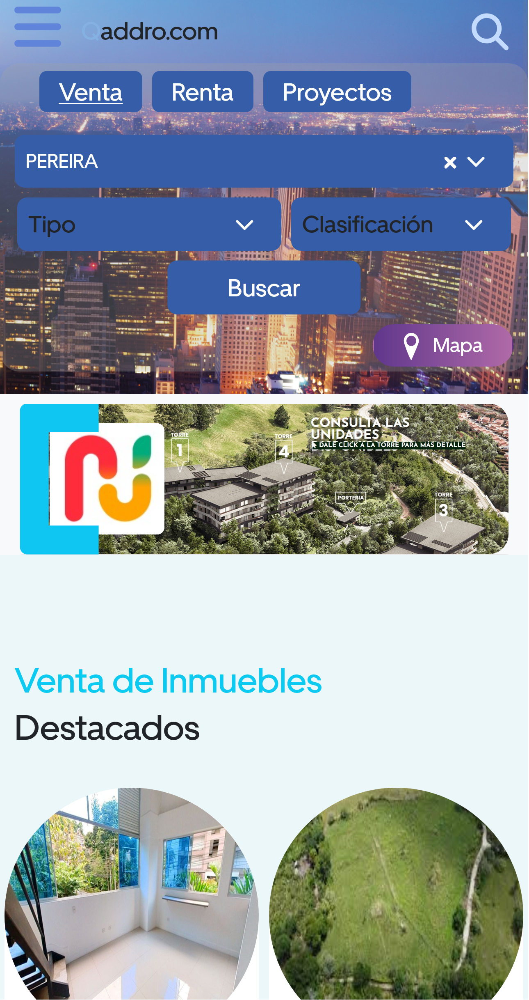
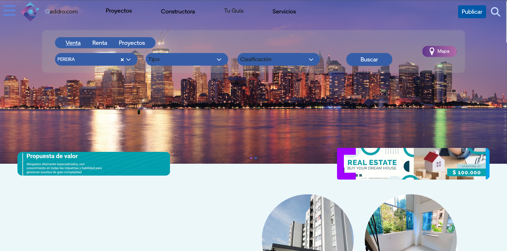
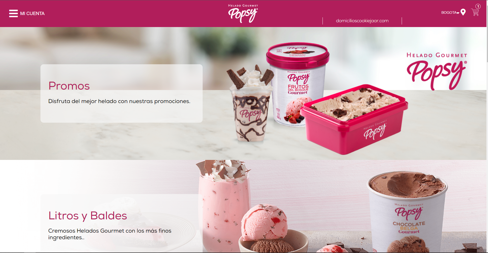
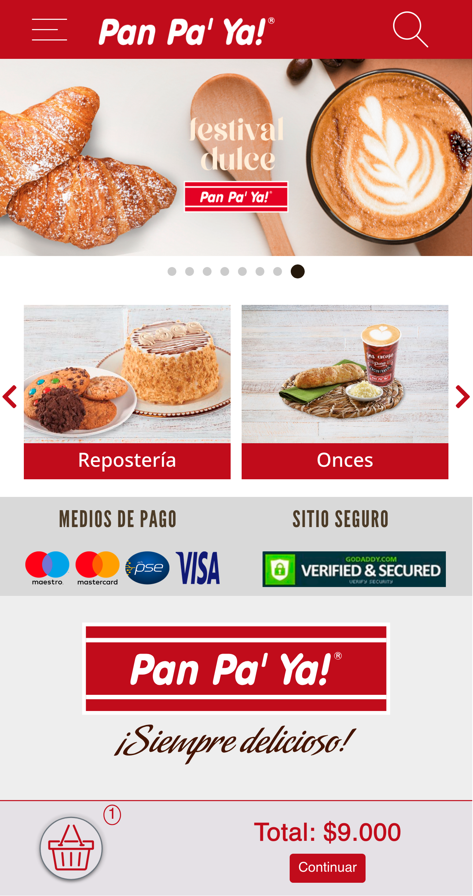
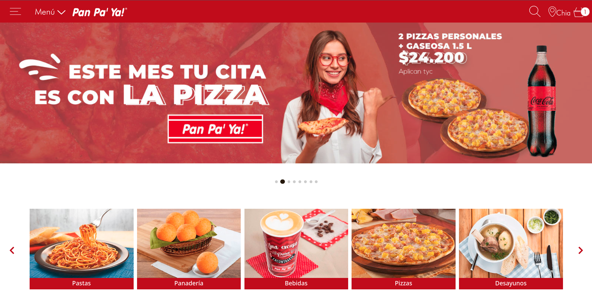
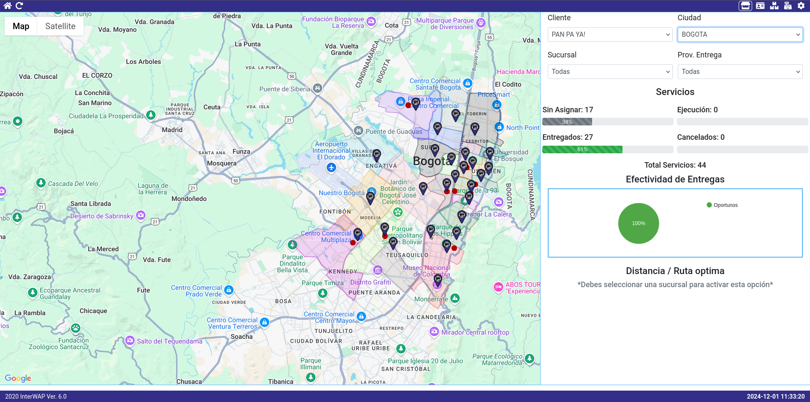
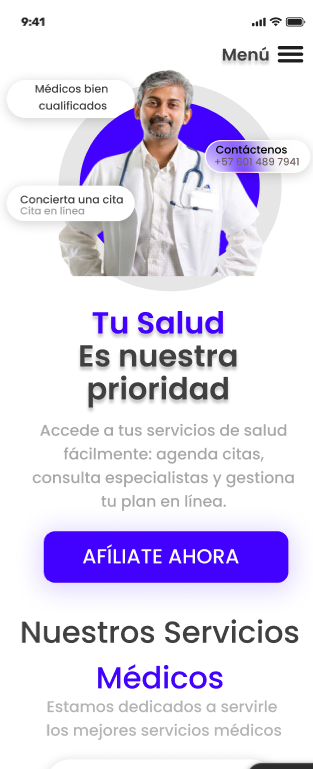
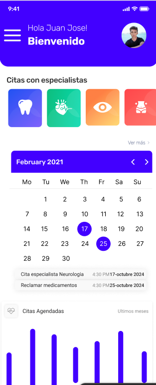

[Comment: Header]: #

# *Hi I'm Fabian Castro*

[![Logo_Github]][Url_Git]
[![Logo_Gmail]][Url_Gmail]
[![Logo_Linkedin]][Url_Linkedin]
[![Logo_stackoverflow]][Url_stackoverflow]
[![Logo_whatsapp]][Url_whatsapp]

I am a passionate web developer and lead developer with extensive experience in multiple programming languages. I love working on challenging projects that allow me to grow and keep learning every day.

## Experience

I have experience in developing high performance web applications, implementing scalable solutions and managing development teams. My focus is on creating effective and efficient solutions that meet customer needs.

## Project Highlights
###### PD: In all the projects I have participated as full stack developer or project leader. Some projects are here in github, others in bitbuckets and other repositories, additionally most of them you can't see the code due to privacy clauses. In some I will leave the url of access, in others not because they are internal platforms.

<b>Good Chat:</b> A Vue.js web app for client order management and chat, integrated with WhatsApp for direct messaging and interaction.

  <table style="border: 0;">
    <tr>
      <td width="24%"></td>
      <td></td>
    </tr>
  </table>

<b>Qaddro:</b> A web app for buying and renting properties, featuring a large inventory of listings and services. It includes an admin panel, client management tools, a web chatbot, and tracking for effective sales.

	<li>URL: <a href="https://qaddro.com">https://qaddro.com</a></li>
  <table style="border: 0;">
    <tr>
      <td width="24%"></td>
      <td></td>
    </tr>
  </table>

<b>Popsy and CookieJaar:</b> A web app with a landing page for client orders, featuring an admin panel for order management and real-time courier tracking.

	<li>URL POPSY: <a href="https://domiciliospopsy.com">https://domiciliospopsy.com</a></li>
	<li>URL COOKIEJAAR: <a href="https://domicilioscookiejaar.com">https://domicilioscookiejaar.com</a></li>
  <table style="border: 0;">
    <tr>
      <td width="24%"></td>
      <td></td>
    </tr>
  </table>

<b>Panpaya:</b> Panpaya is a web app for food order tracking, focused on Panpaya restaurants in Bogotá and nearby cities like Chía. It also includes a mobile app integrated with couriers for real-time delivery tracking.

	<li>URL: <a href="https://panpaya.com.co/">https://panpaya.com.co</a></li>
  <table style="border: 0;">
    <tr>
      <td width="24%"></td>
      <td></td>
    </tr>
	<tr>
      <td colspan="2"></td>
    </tr>
  </table>

<b>Eps Software:</b> A mobile app for managing appointments, medications, authorizations, and other services of a Colombian EPS, featuring admin, client, and doctor panels for comprehensive management.

  <table style="border: 0;">
    <tr>
      <td width="24%"></td>
      <td width="24%"></td>
    </tr>
  </table>

###### These are just some of the projects that I have collaborated in a large percentage of its development and management, there are many more but I do not want to have to fill the space with only projects.

## Tools & Technologies

##### The following technologies are the ones I have used throughout my career and many projects. 

  

## Contact

If you are interested in working with me on a project, feel free to contact me through my email **fc089609@gmail.com**. I'd love to learn more about your needs and discuss how I can help you achieve your development goals.

*Thanks for visiting my Github profile!*

[Comment: Logo]: #

[Logo_Github]: https://img.shields.io/badge/-Github-000?style=flat&logo=Github&logoColor=white
[Logo_Gmail]: https://img.shields.io/badge/-fc089609@gmail.com-000?style=flat-square&logo=gmail
[Logo_Linkedin]: https://img.shields.io/badge/-Linkedin-000?style=flat-square&logo=linkedin
[Logo_stackoverflow]: https://img.shields.io/badge/-StackOverflow-000?style=flat-square&logo=stackoverflow
[Logo_whatsapp]: https://img.shields.io/badge/-WhatsApp-000?style=flat-square&logo=whatsapp

[Comment: Url]: #

[Url_Git]: https://github.com/fast089609
[Url_Gmail]: mailto:fc089609"gmail.com
[Url_Linkedin]: https://www.linkedin.com/in/fabian-castro-lozano-a88a39189
[Url_stackoverflow]: https://stackoverflow.com/users/21520604/fabian-castro-lozano
[Url_whatsapp]: https://wa.me/573177321548
[Url_popsy]: https://domiciliospopsy.com

